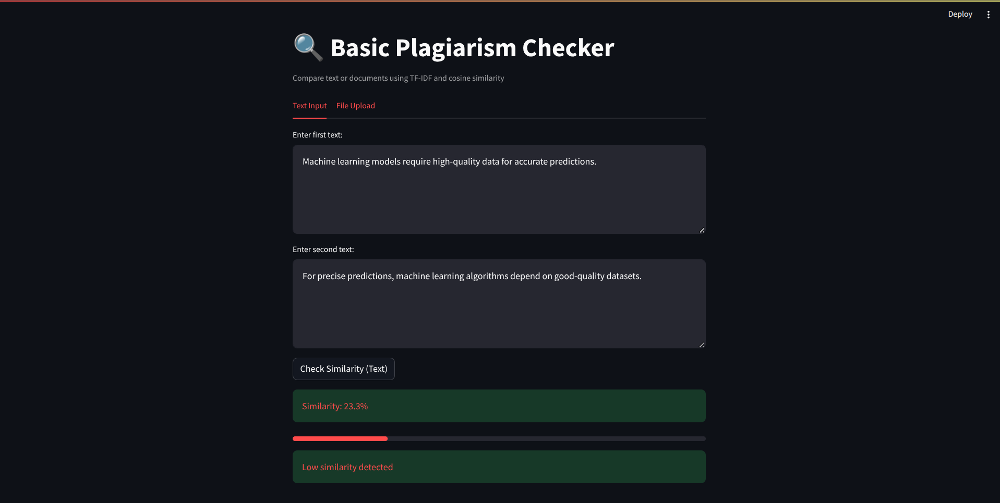
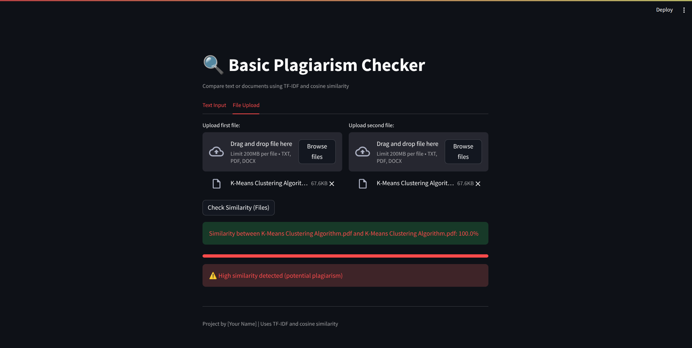

# 🔍 Plagiarism Checker - Basic  
*A lightweight plagiarism checker using TF-IDF and cosine similarity*

## 🎬 Live Demo  
[](https://github.com/rohitkshirsagar19/plagiarism-checker-basic.git)


## 📌 Overview  
This **Plagiarism Checker** is a simple yet effective tool to compare text documents and detect similarity using **TF-IDF (Term Frequency-Inverse Document Frequency)** and **cosine similarity**. The application provides:  

✔ **Text input comparison**  
✔ **File upload support (.txt, .pdf, .docx)**  
✔ **Visual similarity percentage & warnings**  
✔ **User-friendly UI powered by Streamlit**  

---

## ⚡ Features  
🔹 **TF-IDF + Cosine Similarity** for accurate comparison  
🔹 **Preprocessing**: Lowercasing, stopword removal, and lemmatization  
🔹 **File support**: Extracts text from TXT, PDF, and DOCX files  
🔹 **Real-time similarity detection** with interactive progress bar  
🔹 **Custom warning messages** based on similarity scores  

---

## 🚀 Installation  

### 1️⃣ Clone the Repository  
```bash
git clone https://github.com/rohitkshirsagar19/plagiarism-checker-basic.git
cd plagiarism-checker-basic
```

### 2️⃣ Install Dependencies  
```bash
pip install -r requirements.txt
```

### 3️⃣ Run the App  
```bash
streamlit run app.py
```

---

## 🛠️ How It Works  

### Text Preprocessing  
The \`preprocessing.py\` script processes text by:  
✅ Converting to lowercase  
✅ Removing special characters  
✅ Removing stopwords  
✅ Lemmatizing words  

### Similarity Calculation  
The \`similarity.py\` script:  
1️⃣ Converts text into TF-IDF vectors  
2️⃣ Calculates cosine similarity  
3️⃣ Returns similarity percentage  

### Streamlit UI  
The \`app.py\` provides an **interactive UI** for users to:  
📌 **Enter text manually** OR **upload files**  
📌 **View similarity results** in real time  
📌 **Get warnings** for potential plagiarism  

---

## 📸 Screenshots  

### 📊 Similarity Results  


### 📂 File Upload Feature  



---

## 👨‍💻 Tech Stack  
📝 **Python** – Core language  
📖 **NLTK** – Text preprocessing  
📊 **Scikit-learn** – TF-IDF & similarity calculations  
📄 **PyPDF2 / python-docx** – File extraction  
🌐 **Streamlit** – Web-based UI  

---

## 🤝 Contributing  
1. Fork the repo  
2. Create a new branch (\`feature-xyz\`)  
3. Commit changes  
4. Push and create a PR  

---

## 📜 License  
🔹 Open-source under the **MIT License**  

<p align="center">
  Made with 💖 by [rohitkshirsagar19](https://github.com/rohitkshirsagar19) | ⭐ Star this repo if you like it!
</p>
